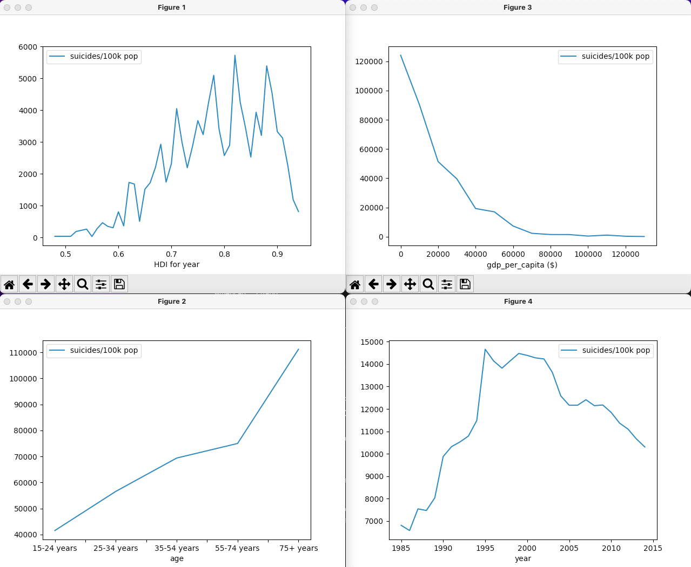

# Overview

This data analysis is of the suicide rate overview from 1985 to 2016 found on [kaggle.com](https://www.kaggle.com/russellyates88/suicide-rates-overview-1985-to-2016). The data consists of suicide counts broken down by country, year, sex, age, population, Human Development Index (HDI), and gross domestic product (GDP).

I'm analyzing this data to answer questions about the relationship between suicide and global circumstances. Another goal was to become familiar with the data processing capabilities of the familiar language Python. The questions analyzed and results are listed below, along with a demo of the code used to analyze the data.

[Software Demo Video](http://youtube.link.goes.here)

# Data Analysis Results

## Questions
1. What is the relationship between average suicide rates and the HDI of countries globally over time?
2. What is the relationship between average suicide rates and the age of victims globally?
3. What is the relationship between average suicide rates and GDP per capita?
4. How are countries' average suicide rates trending globally?

## Figures

## Answers
1. There appears to be a positive correlation between average suicide rates and the HDI of countries. The higher the Human Development Index of the country the higher rates of suicide.
2. There appears to be another positive correlation between average suicide rates and age. Suicide rates tend to increase when population in question is demographically older.
3. A negative correlation seems apparent between average suicide rates and GDP per capita. Effectively meaning the more money there is in a country to go around the lower the rates of suicide to certain point which begins to flat-line.
4. Although appearing to be inconclusive I believe the average global rates of suicide are going down. This is because insufficient polling from the years of 1985 to 1995 would inaccurately skew data displayed in this way. Thus, a negative trend can be observed from 1995 through 2015.

As an additional note, figures one and two appear initially contradictory. One might expect higher rates correlated with a higher HDI to be corroborated by GDP. There is insight to be gained here. Having sufficient wealth available to meet your needs (GDP) makes a large impact on lives up to a point. Running water, electricity, etc. seem important, but the prosperity appears to have the opposite effect. The key is meeting your needs, other human developments aren't necessary for a fulfilling life.

# Development Environment

I used VS Code to create this project.

Python3, Pandas, and Matplotlib made processing this data and powering the graphics possible.

# Useful Websites

This site [Getting started with Data Analysis with Python Pandas](https://towardsdatascience.com/getting-started-to-data-analysis-with-python-pandas-with-titanic-dataset-a195ab043c77) was instrumental in getting off the ground with Data Analytics. However, after grasping the initial concept of data frames, I quickly grew past this resource and continued development with individual searches on [StackOverflow](www.stackoverflow.com).

# Future Work

* Include disclaimers about possible fallacies within the dataset. 
* Include names for each of the visualizations.
* Analyze the relation suicide rates and other categories better fit for a bar graph.